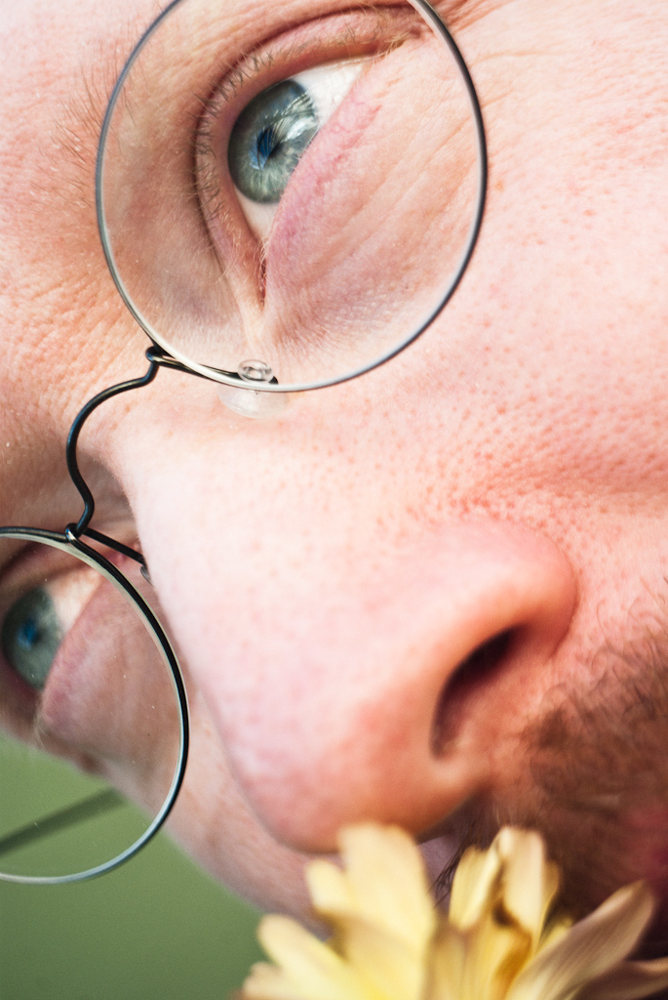
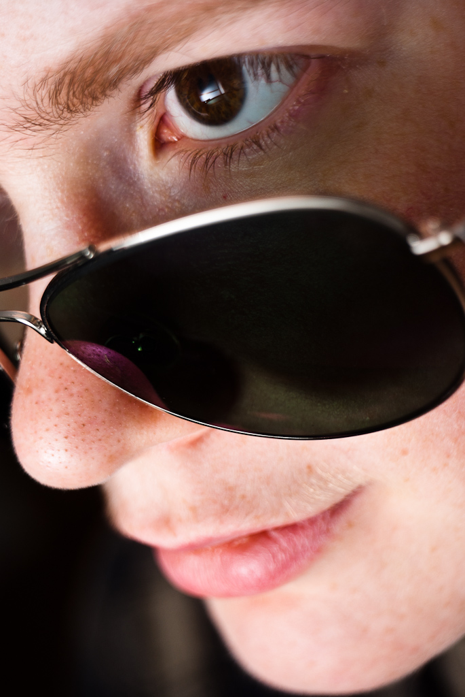
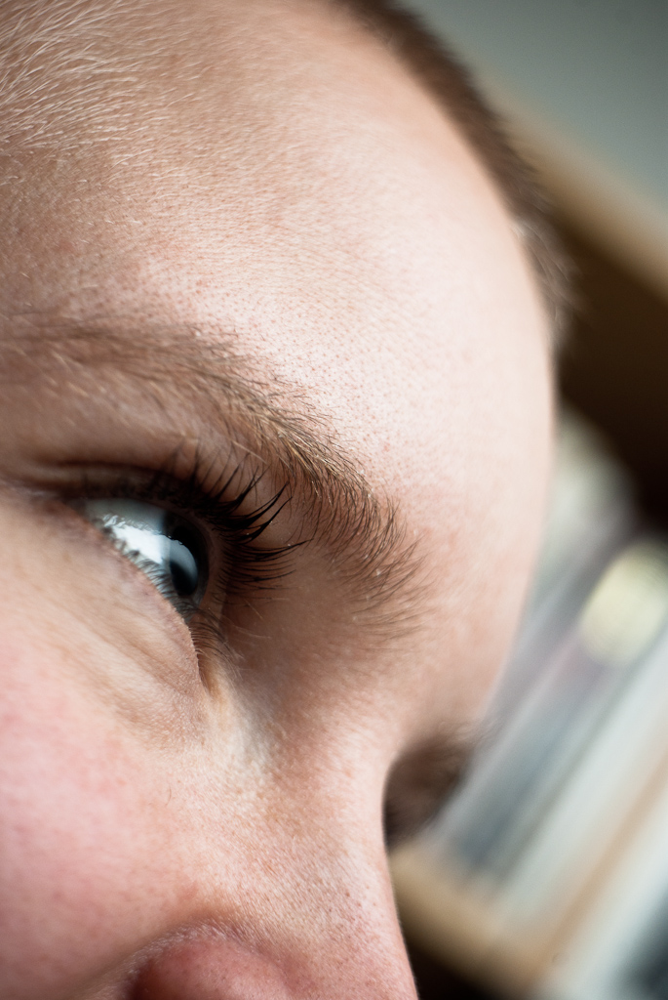
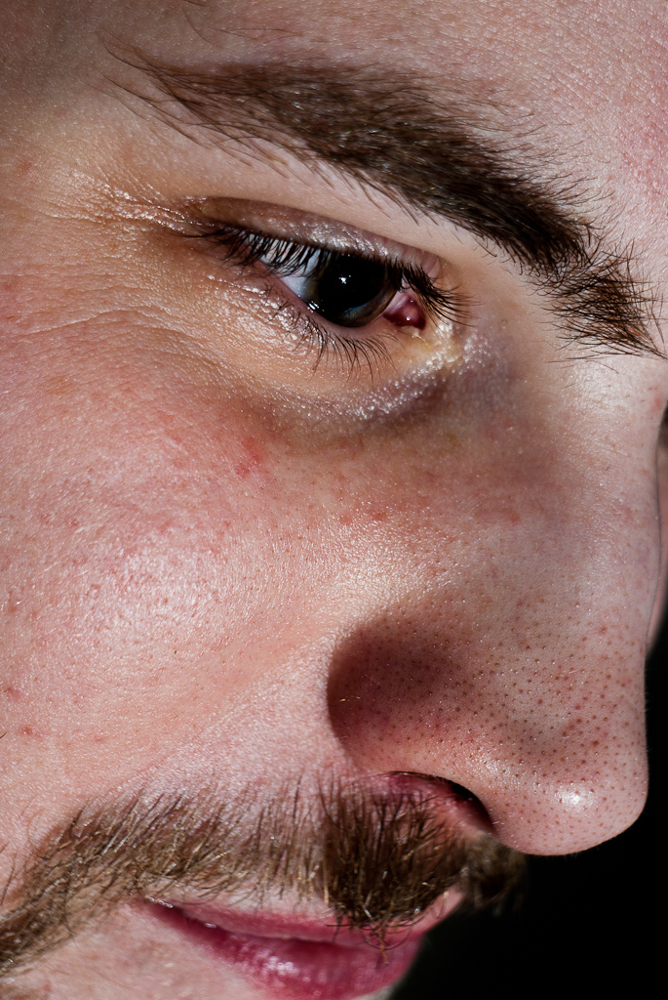
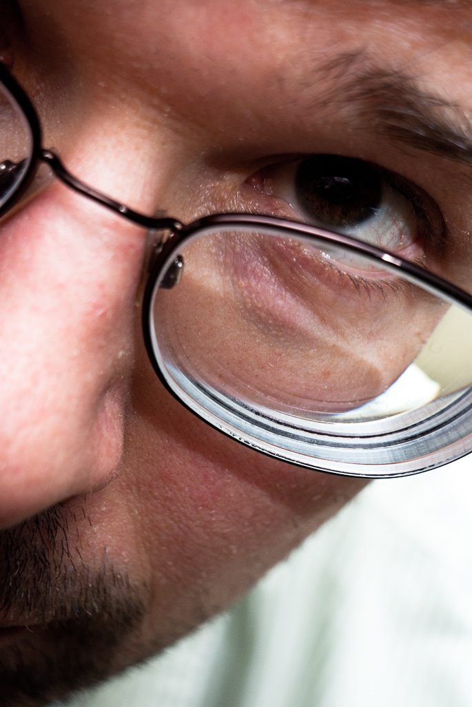
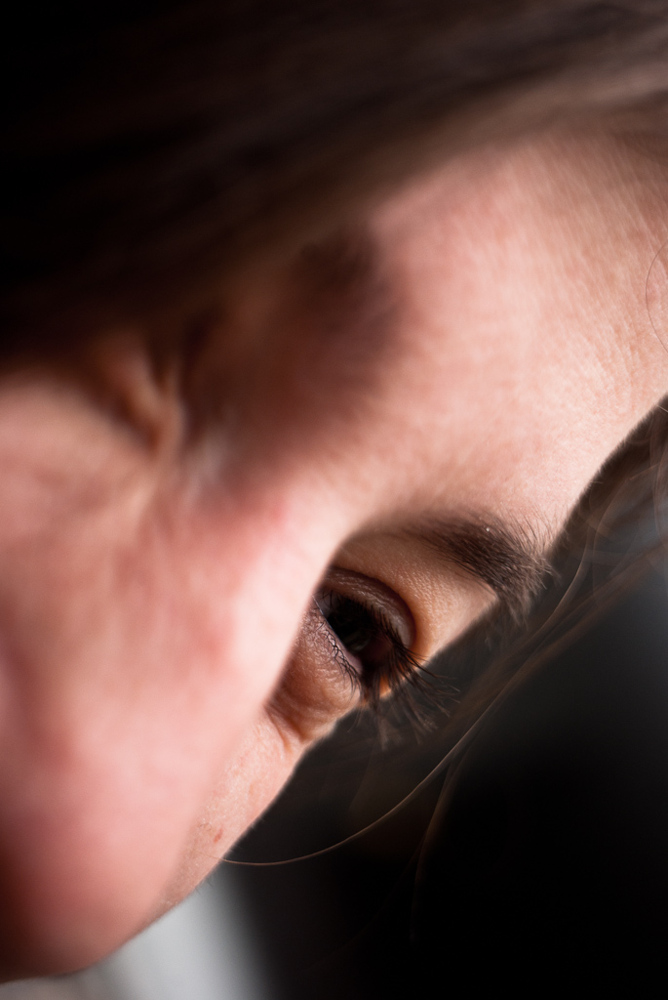
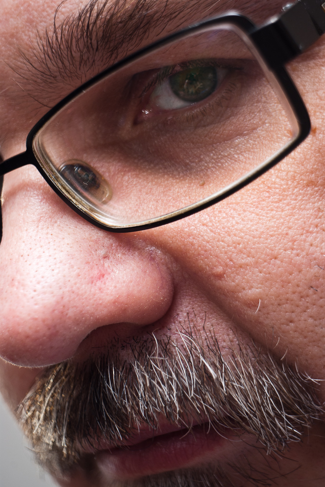
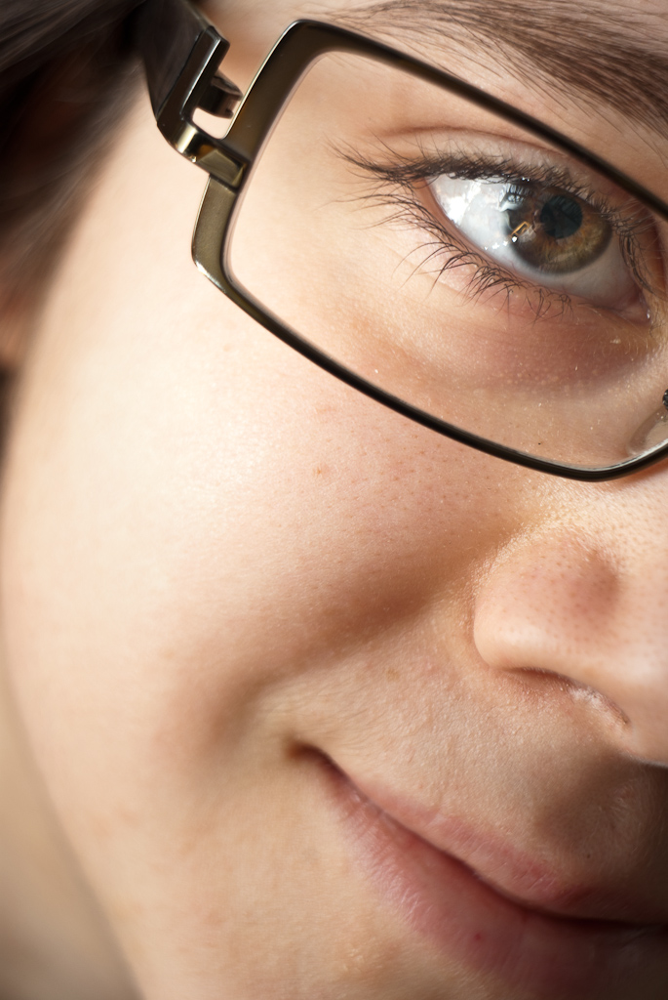

+++
title = "Nära"
path = "nara"
template = "undated_page.html"
+++

_Nära_ (“Near”) is a series of close-up portraits of friends. They have all been made with my _ЛОМО T-43 40mm f/4 lens_ — a surprisingly high quality glass triplet lens. They have also all been made at the same distance and depth of focus, in the 2:3 format of the _Smena 8m_ camera the lens was original made for, with no cropping.

<!-- more -->

