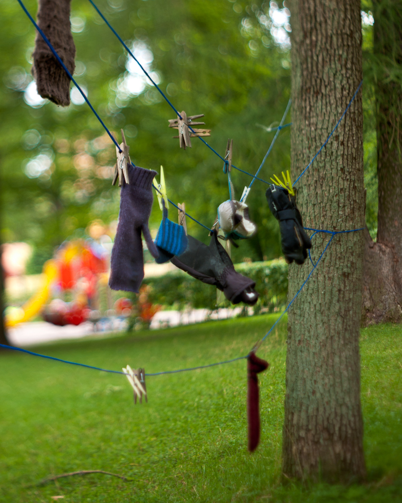

+++
title = "Lost and Found"
date = 2010-09-07

[taxonomies]
categories = ["Photos"]
+++

This is a line for hanging lost gloves and such in Uppsala’s English garden. While I was taking the picture a lady took time out of her day to stay and point out to me what an eyesore the arrangement is.