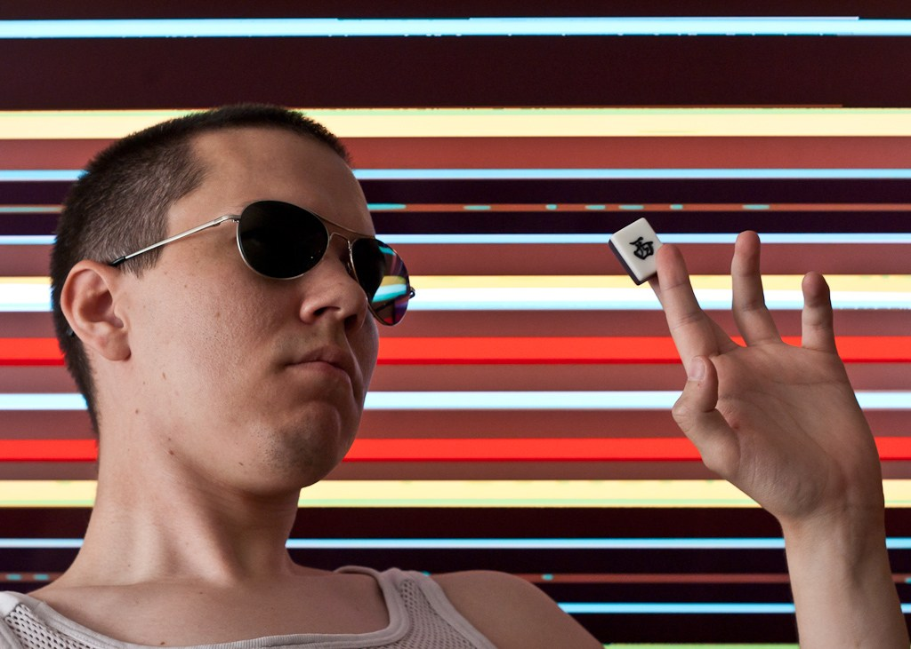

+++
title = "About"
path = "about"
template = "undated_page.html"
+++

I am Björn Lindström, professional systems engineer and amateur photographer living in Bangkok. I used to live in Uppsala, Sweden. If you wish to contact me, send an e-mail to <bkhl@elektrubadur.se>.

I'm also available on various social networks:

* <a rel="me" href="https://mastodon.sdf.org/@bkhl">Mastodon</a>
* <a rel="me" href="https://www.facebook.com/bjorn.lindstrom">Facebook</a>
* <a rel="me" href="https://www.linkedin.com/in/bj%C3%B6rn-lindstr%C3%B6m-573a9261/">LinkedIn</a>
* <a rel="me" href="https://github.com/bkhl">GitHub</a>
* <a rel="me" href="https://gitlab.com/bkhl">GitLab</a>

Elektrubadur is a name I've used for various projects in the past, including [a band](https://www.jamendo.com/artist/4363/elektrubadur) and [a podcast](https://archive.org/details/ElektrubadurPodcast).
