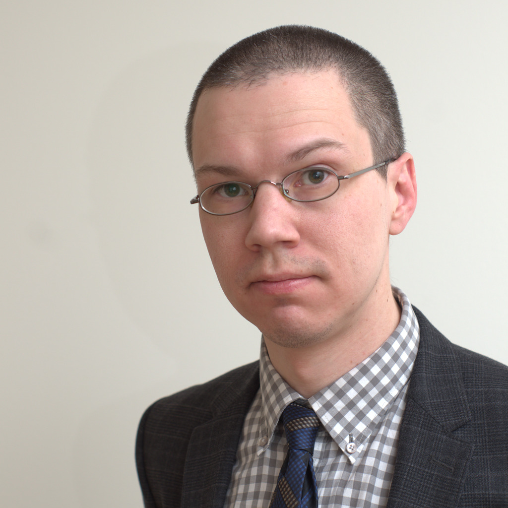

+++
title = "Resumé"
path = "resume"
+++

# Summary

Some of my computer experience is from university and work, but a lot of it is from being a user of Linux, BSD and other free software for over 20 years. I have been in IT professionally for the last 8 years.

---

# Work Experience

### Vizrt Sweden AB

*[Vizrt][] is a software company in the broadcast industry.*

**Systems Engineer** (Jan 2013 – Jan 2015)

Worked with installation, configuration, documentation, testing and fixing of Vizrt's media asset management (MAM) system.

* At first joined a QA team, doing manual testing for a couple of months.
* As a systems engineer, helped complete a successful upgrade project for a major British broadcaster.
* Implemented a proof-of-concept plugin integrating Vizrt products with Adobe After Effects which was used as a demo at a major trade show.
* Temporarily switched department to R&D for three months, to implement a new feature relating to tiered storage, using Perl and Python.

### Vizrt Thailand Ltd.

**Systems Engineer** (Feb 2015 — 2017)

**Senior Systems Engineer** (2018 — 2019)

**Professional Services Technical Lead** (2020 — present)

Moved to Thailand, initially continuing in similar role.

* I have provided training for customers, partners and Vizrt colleagues across the region in the use of the Vizrt MAM's thirdparty REST API, and Python SDK.
* Was the lead systems engineer in a large project for a major broadcaster in India, helping two other teams to integrate with the Vizrt MAM system, one team belonging to a systems integration company, and one to the customer. Spent in total around six months at the customer site in Mumbai, providing instructions and support.
* Took over as lead systems engineer on an upgrade project for a major broadcaster in South Africa, bringing it to a succesful completion without impact to over 100 TV channels depending on the system for media delivery.
* Was made _technical lead_, meaning I take requests for technical advice and estimates from colleagues in the APAC region working as technical sales representatives or solution architects, as well as guiding other systems engineer in best practices for custom software development and deployment.
* Had a hand in many other large and small projects across the region, including work on-site work at broadcasters in China, Thailand, South Africa, Israel, and Singapore, as well as remotely to Malaysia, the Philippines, Australia, New Zeeland and others.

---

# Education

**Uppsala University**, Sweden (2003 - 2007)

* Master programme in computational linguistics (incomplete).
* Independent courses in computer science, literature, and philosophy.

---

# Hobbies and side projects

* Playing [go](https://online-go.com/player/52248/).
* Learning [Godot](https://godotengine.org/) to make computer games as a hobby.
* [Photography](@/galleries/_index.md).
* Mentoring beginners in Python and Bash on [Exercism](https://exercism.io/).
* Learning Thai.

[Vizrt]: http://www.vizrt.com
