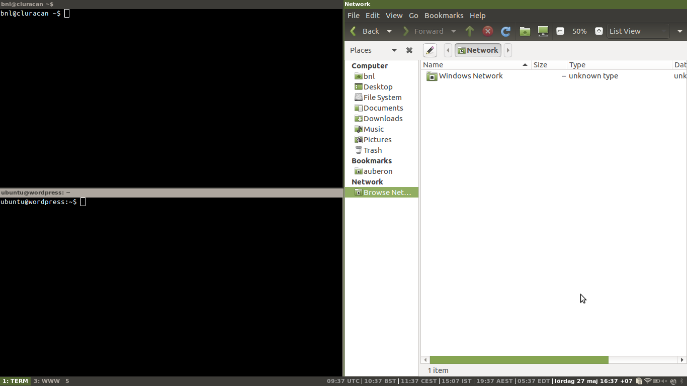

+++
title = "Using i3 in Ubuntu MATE"
date = 2017-05-27
+++

**[Note: I stopped using this, because of some issues with i3 MATE file manager. See [Using i3 in Xubuntu](./using_i3_in_xubuntu/index.md) for the solution I switched to.]**

Here are the steps I've taken to set up the [i3](https://i3wm.org/) window manager in my [Ubuntu Mate](https://ubuntu-mate.org/) desktop environment, based on [MATE](https://mate-desktop.org/).

I have used this with Ubuntu MATE 16.04 and 17.04.



<!-- more -->

# Step 1: Install i3

```
# apt install i3-wm i3status
```

# Step 2: Set window manager

```
$ dconf write /org/mate/desktop/session/required-components/windowmanager "'i3'"
$ dconf write /org/mate/desktop/session/required-components/panel "''"
$ dconf write /org/mate/desktop/session/required-components/filemanager "''"
```

If you would like to use the MATE panel with i3 you can, just leave the panel setting with the default.

# Step 3: Log in again

Log out and then log in again. Unless you have an i3 configuration already, the i3 configuration wizard will be started.

# Next

I contributed a theme to [i3-style](https://github.com/acrisci/i3-style) called mate, to match the default theme of Ubuntu MATE.

As my application launcher I use [Rofi](Rofi), which understands `.desktop` files.

For my entire i3 configuration, see [my configuration repository on GitHub](https://github.com/bkhl/config).