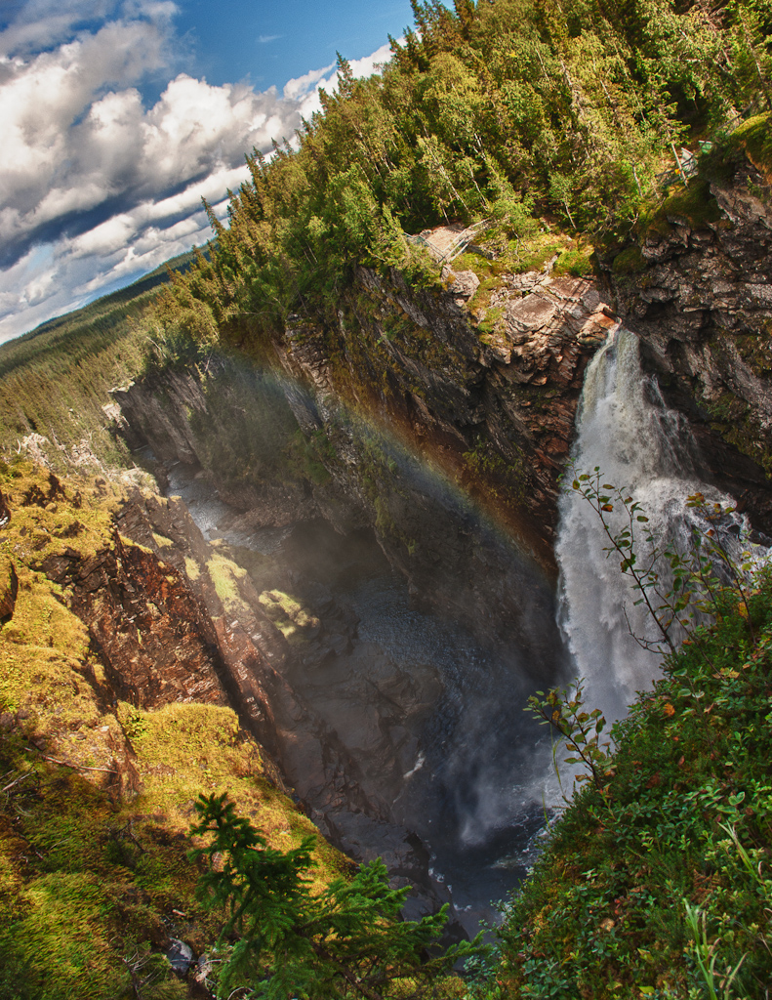

+++
title = "White Water and Colourful Mist"
date = 2010-08-30

[taxonomies]
categories = ["Photos"]
+++

Hällingsåfallet is a waterfall in northern Jämtland, falling into a canyon, probably formed by the end of the last ice age.
